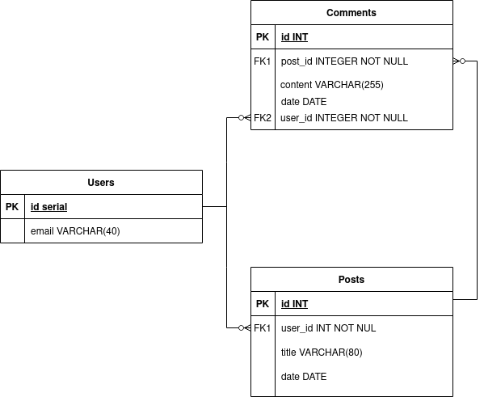

# Intro SQL con Postgres II

En este laboratorio trabajaremos con el tipo de dato SERIAL y haremos consultas realizando operaciones JOIN entre tablas.

Crearemos una base de datos para simular un blog con 3 tablas: Posts, Users y Comments.Agregaremos datos desde archivos CVS y realizaremos distintos tipos de consultas.

## Ejecutando scripts

Los scripts tienen código ejecutable y tienen la ventaja de ser gestionados con Git. Mucho mejor que ejecutar los comandos directamente en la terminal. Además, utilizando simples convenciones es posible ordenarlos y replicar el estado de la base de datos en otros entornos, algo que en el desarrollo profesional se conoce como **Migraciones de base de datos**. Estos scripts que crearemos no son migraciones, pero es similar a lo que se logra al trabajar con ellas y son un buen punto de partida y buena practica de estudio.

Es posible ejecutar los scripts de unas cuantas formas dependiendo de la plataforma (Windows, OSX o Linux). Veamos las más frecuentes:

Directamente desde la terminal Bash

```bash
psql -f scripts/00-createBigCitiesDataBase.sql
```

Desde la terminal PSQL

```sql
\i scripts/00-createBigCitiesDataBase.sql

```

# Modelo a implementar

